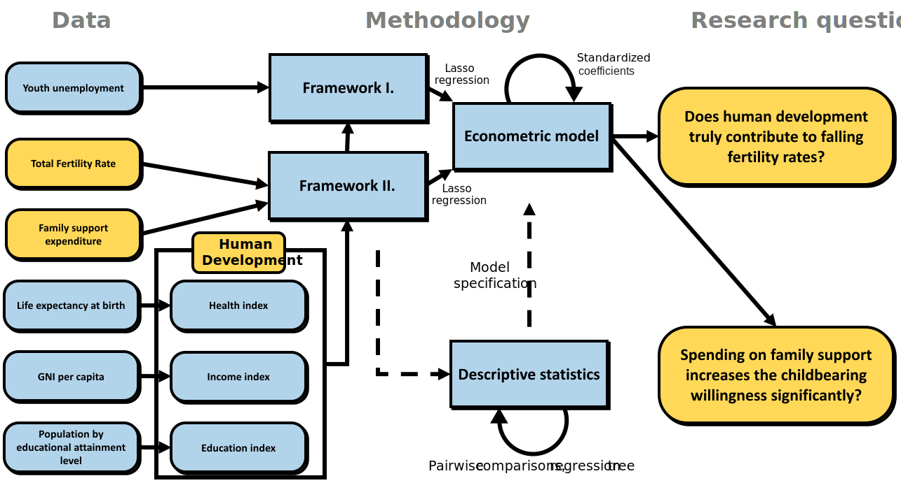

# Introduction {#Chapter-1}

```{css, echo=FALSE}
p {
  text-align: justify;
}
```


Total fertility rates have decreased significantly over the past few decades, and in most of the developed countries, they are far below the minimum level, which would ensure the reproducibility of the population (2.1 children/woman). The motivation why this demographic pattern frequently becomes the focus of scientific and political discussions is that it has a radical impact on the economy of the future.

The one which must be mentioned is that low fertility is one of the key determinants that lead a country to a high old-age dependency ratio. In extreme cases, today's poor childbearing tendency may put huge economic weight on the future working generation. An interesting fact is that this risk is typically faced by developed economies. Moreover, historical data show a clear correlation between the increasing trend of human development and falling childbearing willingness. The first research question I aim to answer in this study is the following: Does human development truly contribute to the fall in fertility rates, and if it does, are the three components (healthy life; access to knowledge; decent standard of living) included with the same weight?

The related literature contains many uncertainties about this question. Not even the existence of the relation, but the correct direction of the effect is also unclear. An important milestone is a piece of empirical evidence that the association between development and fertility might turn from negative to positive above a given threshold of development^[Myrskylä, M., Kohler, H.-P., and Billari, F. C. (2009). Advances in development reverse fertility declines. Nature, 460(7256):741–743.].

Detecting the trend of falling fertility rates is not new. It is well documented that this issue was a key question in politics in many countries after the second world war, and so is nowadays. Governments around the world have already implemented several policies to increase fertility: Abortion ban, campaigns and various financial incentives. But the effectiveness (and their social benefit in many other important aspects) of these are often questioned. Since only the last one is frequently applied (and can be observed accurately) in the developed countries, my second research question is whether spending on family support increases the childbearing willingness significantly.

The contribution of the current paper to the literature is that it applies longitudinal econometrics on NUTS-2 level regional annual observations. Eurostat is the main source of the data. I use fixed effect panel regression to estimate the effect of the mentioned predictors on fertility. Important to note that statistics about unemployment are available only for a critically short period in the case of many regions. To manage this highly unbalanced nature of the dataset – while not rejecting the possibility to control for youth unemployment – I estimate the model with two different modeling frames: one without youth unemployment and another one with it. Figure 1 visualize the main steps of the current paper.

```{r fig.cap="Main steps of the study"}

```

As a result, the paper confirms the *empirical evidence that increasing human development in developed countries has a positive effect on total fertility rates, and income is the most important component*. This finding is robust to the mentioned two frameworks. In contrast, the research come up *only with week evidence for the significant effect of expenditure on family on total fertility rates on the long run*. 

To ensure fully reproducibility I enclose the used codes in the Appendix, but these are also available on the following GitHub repository:  https://github.com/MarcellGranat/fertilityEU.


